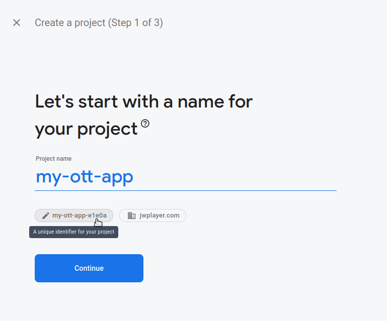

# Easy Deployments

The instructions in this document will help you deploy your fork of the ott-web-app to some of the popular web application hosting platforms.

## Prerequisites

1. [Fork this repo](https://docs.github.com/en/get-started/quickstart/fork-a-repo).
2. Follow the instructions in [docs/build-from-source.md](build-from-source.md).

## Supported Platforms

- [Google Firebase](#google-cloud-/-firebase): Free, easy to use [web hosting service](https://firebase.google.com/) with [integrations](https://firebase.google.com/docs/hosting/github-integration) to deploy directly from github and support for integrated backend hosting.
- [GitHub Pages](#github-pages): Static hosting [directly from a repository](https://docs.github.com/en/pages/getting-started-with-github-pages/about-github-pages) though with some limitations

### Google Cloud / Firebase

The app can be hosted on Google Firebase (frontend) and/or using Google Cloud Run for the backend of the lightweight API.

#### Technical Limitations

Firebase has both [free and paid plans](https://firebase.google.com/pricing).
The [limits](https://firebase.google.com/docs/hosting/usage-quotas-pricing) are determined by Google and are likely to change and evolve, but at the moment they are based on the storage and data transfer per month.  Note that storage limits are calculated including preview releases and old release versions, so you may want to [limit the retention](https://firebase.google.com/docs/hosting/manage-hosting-resources#release-storage-settings) of these on your project.

**Note:** if you want to use Cloud Run backend hosting, you need to enable a billing account.
Even though the services needed have free tiers, Google requires a billing account be setup to enable the necessary APIs.

#### Usage Instructions

The easiest way to deploy is to use the existing actions in this repo:
* [`firebase-live.yml`](.github/workflows/firebase-live.yml) - deploys the frontend code to the live Firebase hosting on any commit to the main (`develop`) branch 
* [`firebase-preview.yml`](.github/workflows/firebase-preview.yml) - deploys the frontend code to Firebase hosting using a temporary preview channel for any PR created on the main (`develop`) branch 
* [`deploy-backend.yml`](.github/workflows/deploy-backend.yml) - deploys the backend code to Cloud Run. Currently only triggered via manual dispatch.

You can use the setup script [`scripts/gcloud-setup.sh`](scripts/gcloud-setup.sh) to configure all of the settings and policies for you.
For more details see [Running the gcloud-setup script](#running-the-gcloud-setup-script) below.

The frontend is deployed with the [Firebase-Github integration](https://firebase.google.com/docs/hosting/github-integration).
You can find the action [.yml specifications here](https://github.com/marketplace/actions/deploy-to-firebase-hosting) to deploy to a preview channel for each PR and to the live channel for each merge to your main branch.
Both the firebase-live and firebase-preview actions use this integration.
* These actions use an auth key for a gcloud service worker to do the deployment. The key should be stored in the Github secret named `FIREBASE_SERVICE_ACCOUNT_KEY`.
  * The setup script will create a file named GITHUB_SECRET__FIREBASE_SERVICE_ACCOUNT_KEY containing the value that this secret should be set to.
  **Note:** This value is sensitive and should be treated carefully. Only copy the value to an encrypted repo secret. Do not share it or commit it to git.   
* These actions also depend on the Github secret GCLOUD_PROJECT, which the setup script will also create a file for. It should be set to the project ID of your Firebase / GCloud project. 
* You can also manually deploy using the Firebase CLI, as described [here](https://firebase.google.com/docs/hosting/quickstart).

Similarly, you can deploy the backend using the [Deploy to Cloud Run Github action](https://github.com/marketplace/actions/deploy-to-cloud-run).
This action uses Cloud Build to build the docker image, stores it in the GCloud Artifact Registry, and deploys it to Cloud Run.
You can manually trigger the deploy-backend action from the Actions section on Github.
* This action uses the [Google Github Action Auth step](https://github.com/google-github-actions/auth) to authenticate, which is a safer, more secure integration.
  * This step depends on the secrets GCLOUD_IDENTITY_PROVIDER and GCLOUD_SERVICE_ACCOUNT both of which will have GITHUB_SECRET_ files created from the setup script. These values are not sensitive, but are set as secrets for modularity of the action (i.e. using it in a fork or updating it to point to a new GCloud project without changing source code.)
* This action also uses the GCLOUD_REGION. This should match the region used when running the setup script which can be found in the GITHUB_SECRET__GCLOUD_REGION file after running the script.

#### Running the gcloud-setup script
This script will prompt you for the project, repo, and region to use and then walk you through setting up the settings and policies on Google Cloud and Firebase.
It uses both gcloud and firebase cli's, so these must be installed. You must also create a project beforehand, and,
if you want to use the Cloud Run backend, you will need to have a billing account setup beforehand that the script can link to the project.
For more details see the steps below.

As it runs, the script will generate files named `GITHUB_SECRET__<SECRET NAME>`, which are text files containing the appropriate values to set in the repo's secrets, based on the setup script configuration.
You can copy and paste the contents of each file into a similarly named repo secret (without the 'GITHUB_SECRET__' prefix.)
Some of these files may contain sensitive data, so they have been added to gitignore. Be careful not to share or commit the files.

The script can be run for either the frontend or backend setup or both by following the prompts.
The intent of the script is to be idempotent, although it has had only limited testing.
If you get stuck, it may be easiest to delete the GCloud project completely and start again with a clean project.

Steps to run: 
1) Create a Firebase project using the [Firebase console](https://console.firebase.google.com/).
   This will create a Firebase project, but behind the scenes it also creates a Google Cloud project with the same name and ID.
     
   Note what you choose for the Project ID.  It will be used for a lot of commands and the Firebase hosted URL if you don't want to setup a custom one (i.e. `https://<Project ID>.web.app`)
   so be careful to manually edit it to something that you can remember and that will make sense to be part of the public facing URL.
   You can edit it by clicking the little tag bubble with the edit pencil below the display name.
     
   **NOTE:** After you create the project you will not be able to edit the Project ID.
     
   
     
2) If you intend to use the backend services (i.e. Cloud Build and Cloud Run) you will need to enable billing.
   Even though there is a free tier for these services, Google still requires billing to be enabled to use them.
     
   Even though the `gcloud-setup.sh` script will enable and link billing for the project,
   you need to create a billing account through the Google Cloud Console: https://console.cloud.google.com/billing
3) Install the gcloud cli: https://cloud.google.com/sdk/docs/install
4) Install the firebase cli: https://firebase.google.com/docs/cli#install_the_firebase_cli
5) Run [scripts/gcloud-setup.sh](scripts/gcloud-setup.sh) to setup everything your project needs for frontend hosting on Firebase
   and/or backend hosting with Cloud Run, including policies to allow deployment from the github actions.
6) Copy and paste the values from the `GITHUB_SECRET__<SECRET NAME>` files into correspondingly named secrets on the Github repo.

### Github Pages

#### Technical Limitations

Github pages is bare bones static hosting, not optimized for single page apps. This means that urls do not automatically redirect to index.html.  For this reason, the Github deploy scripts configure the application to use [hash routing](https://v5.reactrouter.com/web/api/HashRouter), which may be undesirable for production applications. 

Github pages also has some [usage limits](https://docs.github.com/en/pages/getting-started-with-github-pages/about-github-pages#usage-limits).  These limits are determined by Github and are likely to change and evolve, but at the moment they are primarily on the repo size, the bandwidth, and the number of builds per hour. After reviewing the current Github pages limits, if you anticipate exceeding these, you should consider other paid hosting solutions.

#### Usage Instructions

1. (Optional) If you need a customization option, review `yarn deploy:github --help`.
2. Confirm that you can [build this project from source](./build-from-source.md). Be sure to install optional dependencies.
3. Enable the [Github Pages feature](https://docs.github.com/en/pages/getting-started-with-github-pages) for the `gh-pages` branch in your repository.
4. Run `yarn deploy:github`. Be sure to follow the instructions that appear on the screen. If you want to connect your github deployment to a custom domain remember to add `--custom-domain=mydomain.com`

### Technical Documentation

The `yarn deploy:github` command executes a simple nodejs script located in `scripts/deploy-github.js`. The script executes the following commands:

1. Runs `yarn build` with `APP_GITHUB_PUBLIC_BASE_URL` envvar.  That envvar is used to set the URL location of the project. By default if `APP_GITHUB_PUBLIC_BASE_URL` is empty, the value will be based on the `git remote get-url origin` command. You can also pass your own `APP_GITHUB_PUBLIC_BASE_URL` envvar by running `APP_GITHUB_PUBLIC_BASE_URL=/my-base/ yarn deploy:github`.
2. Runs `yarn gh-pages -o origin -d build`.  You can change the remote from *origin* to *myremote* by running `yarn deploy:github --github-remote=myremote`.  The `yarn deploy:github` command uses the GitHub remote to compute the default value for `APP_GITHUB_PUBLIC_BASE_URL`.

>**TIP**: Before each of the previous steps, the script will ask if you want to continue. You can prevent these confirmation inquiries by providing `--build` or `--deploy` arguments to `yarn deploy:github`.

